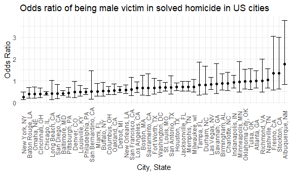

p8105_hw6_waa2119
================
William Anderson
2022-11-28

``` r
library(tidyverse)
library(lubridate)
library(modelr)
library(mgcv)

knitr::opts_chunk$set(
  fig.width = 6,
  fig.asp = .6,
  out.width = "90%"
)

theme_set(theme_minimal() + theme(legend.position = "bottom"))

options(
  ggplot2.continuous.colour = "viridis",
  ggplot2.continuous.fill = "viridis"
)

scale_colour_discrete = scale_colour_viridis_d
scale_fill_discrete = scale_fill_viridis_d
```

## Problem 2

First we will read in the homicide data from the Washington Post

``` r
homicide_data = 
  
  read_csv("hw6_data/homicide-data.csv") %>%
  
  janitor::clean_names() %>%
  
  mutate(
    reported_date = ymd(reported_date)) %>%
  
  mutate(victim_age = as.numeric(victim_age)) %>%
  
  mutate(city_state = str_c(city, ", ", state)) %>%
  
  mutate(unsolved = ifelse(disposition == "Closed without arrest" | disposition == "Open/No arrest", 1, 0)) %>%
  
  mutate(resolved = as.numeric(disposition == "Closed by arrest")) %>%
 
    filter(!city_state %in% c("Tulsa, AL", "Dallas, TX", "Phoenix, AZ", "Kansas City, MO")) %>% 
  
  filter(victim_race %in% c("White", "Black")) %>%
  
  filter(victim_sex %in% c("Male", "Female")) %>%
  
  mutate(victim_race = fct_relevel(victim_race, "White"))


head(homicide_data, 20)
```

    ## # A tibble: 20 × 15
    ##    uid      reported…¹ victi…² victi…³ victi…⁴ victi…⁵ victi…⁶ city  state   lat
    ##    <chr>    <date>     <chr>   <chr>   <fct>     <dbl> <chr>   <chr> <chr> <dbl>
    ##  1 Alb-000… 2010-06-01 SATTER… VIVIANA White        15 Female  Albu… NM     35.1
    ##  2 Alb-000… 2010-01-02 MULA    VIVIAN  White        72 Female  Albu… NM     35.1
    ##  3 Alb-000… 2010-01-26 BOOK    GERALD… White        91 Female  Albu… NM     35.2
    ##  4 Alb-000… 2010-01-30 MARTIN… GUSTAVO White        56 Male    Albu… NM     35.1
    ##  5 Alb-000… 2010-02-18 LUJAN   KEVIN   White        NA Male    Albu… NM     35.1
    ##  6 Alb-000… 2010-03-08 GRAY    STEFAN… White        43 Female  Albu… NM     35.1
    ##  7 Alb-000… 2010-03-23 DAVID   LARRY   White        52 Male    Albu… NM     NA  
    ##  8 Alb-000… 2010-04-02 BRITO   ELIZAB… White        22 Female  Albu… NM     35.1
    ##  9 Alb-000… 2010-04-23 KING    TEVION  Black        15 Male    Albu… NM     35.1
    ## 10 Alb-000… 2010-04-23 BOYKIN  CEDRIC  Black        25 Male    Albu… NM     35.1
    ## 11 Alb-000… 2010-05-18 BARRAG… MIGUEL  White        20 Male    Albu… NM     35.1
    ## 12 Alb-000… 2010-06-02 WRONSKI VIOLA   White        88 Female  Albu… NM     35.1
    ## 13 Alb-000… 2010-07-12 TURNER  MICHEL… White        36 Female  Albu… NM     35.1
    ## 14 Alb-000… 2010-07-12 CUNNIN… SHARON  White        47 Female  Albu… NM     35.1
    ## 15 Alb-000… 2010-09-19 CHECKL… MICHAEL White        24 Male    Albu… NM     35.2
    ## 16 Alb-000… 2010-09-19 FREEMAN JAMES   White        41 Male    Albu… NM     35.1
    ## 17 Alb-000… 2010-10-09 STOWE   KIMBREL White        50 Male    Albu… NM     35.1
    ## 18 Alb-000… 2010-10-24 BARKER  PAUL    White        51 Male    Albu… NM     35.1
    ## 19 Alb-000… 2010-10-28 MALDON… CHRIST… Black        18 Male    Albu… NM     35.1
    ## 20 Alb-000… 2010-11-07 JOHNSON DAWYNE  Black        18 Male    Albu… NM     35.1
    ## # … with 5 more variables: lon <dbl>, disposition <chr>, city_state <chr>,
    ## #   unsolved <dbl>, resolved <dbl>, and abbreviated variable names
    ## #   ¹​reported_date, ²​victim_last, ³​victim_first, ⁴​victim_race, ⁵​victim_age,
    ## #   ⁶​victim_sex

For the city of Baltimore, MD we will use the glm function to fit a
logistic regression with resolved vs unresolved as the outcome and
victim age, sex and race as predictors and obtain the estimate and
confidence interval of the adjusted odds ratio for solving homicides
comparing male victims to female victims keeping all other variables
fixed.

``` r
fit_logistic = 
  
homicide_data %>%
  
  filter(city_state %in% "Baltimore, MD") %>%
  
  select(resolved, victim_age, victim_race, victim_sex) %>%

  glm(resolved ~ victim_age + victim_race + victim_sex, data = ., family = binomial()) %>%
  
  broom::tidy(conf.int = TRUE, conf.level = 0.95, exponentiate = TRUE) %>%
  
  mutate(OR = estimate) %>%
  
  mutate(log_OR = log(estimate)) %>%
  
  filter(term %in% "victim_sexMale") %>%
  
  select(term, log_OR, OR, conf.low, conf.high, p.value)


head(fit_logistic, 20)
```

    ## # A tibble: 1 × 6
    ##   term           log_OR    OR conf.low conf.high  p.value
    ##   <chr>           <dbl> <dbl>    <dbl>     <dbl>    <dbl>
    ## 1 victim_sexMale -0.854 0.426    0.324     0.558 6.26e-10

The odds of being a male victim in a solved homicide in Baltimore is
0.426 compared to female victims meaning it is more likely to be a
female victim in a solved homicide in Baltimore.

Now we will run the glm function for each of the cities in the dataset,
and extract the adjusted odds ratio (and CI) for solving homicides
comparing male victims to female victims.

``` r
fit_all = 
  
  homicide_data %>%
  
  nest(df = -city_state) %>%
  
  mutate(
    glm_fits = map(.x = df, ~glm(resolved ~ victim_age + victim_race + victim_sex, data = .x, family = binomial())),
    
    results = map(glm_fits, ~broom::tidy(x = .x, conf.int = TRUE, conf.level = 0.95, exponentiate = TRUE))) %>%
  
  unnest(results) %>% 
  
  mutate(OR = estimate) %>%
  
  mutate(log_OR = log(estimate)) %>%
  
  filter(term %in% "victim_sexMale") %>%
  
  select(city_state, term, log_OR, OR, conf.low, conf.high, p.value)


head(fit_all, 20)
```

    ## # A tibble: 20 × 7
    ##    city_state       term               log_OR    OR conf.low conf.high  p.value
    ##    <chr>            <chr>               <dbl> <dbl>    <dbl>     <dbl>    <dbl>
    ##  1 Albuquerque, NM  victim_sexMale  0.570     1.77     0.825     3.76  1.39e- 1
    ##  2 Atlanta, GA      victim_sexMale  0.0000771 1.00     0.680     1.46  1.00e+ 0
    ##  3 Baltimore, MD    victim_sexMale -0.854     0.426    0.324     0.558 6.26e-10
    ##  4 Baton Rouge, LA  victim_sexMale -0.964     0.381    0.204     0.684 1.65e- 3
    ##  5 Birmingham, AL   victim_sexMale -0.139     0.870    0.571     1.31  5.11e- 1
    ##  6 Boston, MA       victim_sexMale -0.404     0.667    0.351     1.26  2.12e- 1
    ##  7 Buffalo, NY      victim_sexMale -0.653     0.521    0.288     0.936 2.90e- 2
    ##  8 Charlotte, NC    victim_sexMale -0.123     0.884    0.551     1.39  6.00e- 1
    ##  9 Chicago, IL      victim_sexMale -0.891     0.410    0.336     0.501 1.86e-18
    ## 10 Cincinnati, OH   victim_sexMale -0.917     0.400    0.231     0.667 6.49e- 4
    ## 11 Columbus, OH     victim_sexMale -0.630     0.532    0.377     0.748 3.04e- 4
    ## 12 Denver, CO       victim_sexMale -0.736     0.479    0.233     0.962 4.11e- 2
    ## 13 Detroit, MI      victim_sexMale -0.541     0.582    0.462     0.734 4.51e- 6
    ## 14 Durham, NC       victim_sexMale -0.208     0.812    0.382     1.66  5.76e- 1
    ## 15 Fort Worth, TX   victim_sexMale -0.402     0.669    0.394     1.12  1.31e- 1
    ## 16 Fresno, CA       victim_sexMale  0.289     1.34     0.567     3.05  4.96e- 1
    ## 17 Houston, TX      victim_sexMale -0.341     0.711    0.557     0.906 5.93e- 3
    ## 18 Indianapolis, IN victim_sexMale -0.0848    0.919    0.678     1.24  5.82e- 1
    ## 19 Jacksonville, FL victim_sexMale -0.329     0.720    0.536     0.965 2.83e- 2
    ## 20 Las Vegas, NV    victim_sexMale -0.178     0.837    0.606     1.15  2.78e- 1

Now we will create a plot that shows the estimated ORs and CIs for each
city and organize cities according to estimated OR.

``` r
 ggplot(fit_all, aes(x = reorder(city_state, OR), y = OR)) + 
    
  geom_point() + 
    
  geom_errorbar(aes(ymin = conf.low, ymax = conf.high)) +   
  
  theme(axis.text.x = element_text(angle = 90, vjust = 0.5)) + 
  
  labs(
    title = "Odds ratio of being male victim in solved homicide in US cities", 
    
    y = "Odds Ratio", 
    
    x = "City, State"
  )
```



The odds of being a male victim in a solved homicide in Albuquerque is
1.77 times more likely than being a female victim and is the highest in
the USA. The odds of being a male victim in a solved homicide in New
York City is 0.26 times more likely than being a female victim and is
the lowest in the USA, meaning it is more likely to be a female victim
in a solved homicide in New York City. We see that in the majority of
cities it is less likely to be a male victim in a solved homicide than
being female as the majority of cities have an odds ratio that is less
than 1 for being a male victim. Only 6 cities out of the 47 in this data
set had an odds ratio greater than 1 for being a male victim in a solved
homicide. However there is significant dispersion in the data and the
confidence intervals are fairly large so the odds ratio data must be
interpreted with caution.

## Problem 3

First we will load the birthweight data

``` r
birth_weight = read_csv("hw6_data/birthweight.csv", na = "") %>%
  
  mutate(babysex = as.factor(babysex),
         
         frace = as.factor(frace),
         
         malform = as.factor(malform),
         
         mrace = as.factor(mrace))
```

    ## Rows: 4342 Columns: 20
    ## ── Column specification ────────────────────────────────────────────────────────
    ## Delimiter: ","
    ## dbl (20): babysex, bhead, blength, bwt, delwt, fincome, frace, gaweeks, malf...
    ## 
    ## ℹ Use `spec()` to retrieve the full column specification for this data.
    ## ℹ Specify the column types or set `show_col_types = FALSE` to quiet this message.

``` r
  anyNA(birth_weight)
```

    ## [1] FALSE

I am proposing a model for birthweight with the predictors being number
of cigarettes smoked by the mother during pregnancy, the presence of
malformations, the babys head circumference, the baby’s length, and the
gestational age in weeks. I believe these factors play a significant
role in determining the baby’s weight at birth because the mother
smoking cigarettes affects fetus development and its birth weight,
malformations can affect weight causing the baby to weigh less at birth,
head circumference is directly linked to weight as the larger
circumference leads to higher weight, and the longer a baby is the more
they will weigh at birth. Additionally, premature gestational age
results in a lower weight for the child at birth. All of these factors
should play a role in determining the baby’s weight at birth.

``` r
birth_model = 
  
  lm(bwt ~ smoken + malform + bhead + blength + gaweeks, data = birth_weight)


  birth_model %>%
  
  broom::tidy() %>%
  
  select(term, estimate, p.value)
```

    ## # A tibble: 6 × 3
    ##   term        estimate   p.value
    ##   <chr>          <dbl>     <dbl>
    ## 1 (Intercept) -6173.   0        
    ## 2 smoken         -1.87 1.46e-  3
    ## 3 malform1       46.2  5.33e-  1
    ## 4 bhead         138.   1.93e-288
    ## 5 blength        81.3  1.71e-285
    ## 6 gaweeks        14.9  8.29e- 23

``` r
  birth_weight %>%
  
  modelr::add_residuals(birth_model) %>%
  
  modelr::add_predictions(birth_model) %>% 
    
  ggplot(aes(x = pred, y = resid)) +
  
  geom_point(alpha = 0.3) + 
  
  geom_smooth(se = FALSE, method = "lm") + 
  
  labs(title = "Residuals vs Fitted values for my birth weight model", 
       
       x = "Fitted Values", 
       
       y = "Residuals")
```

    ## `geom_smooth()` using formula 'y ~ x'


From the model results table we can see that all the terms are
significant in predicting a baby’s birth weight except for the presence
of malformations as the p-value for that term is 0.533 while the other
terms are much smaller than 0.05.

Looking at the residuals vs fitted values for the model I developed we
see that the residual values bounce around the zero line which suggests
that a linear relationships between the terms is appropriate to model.

Now we will compare this model to two others:

- One using length at birth and gestational age as predictors (main
  effects only)

- One using head circumference, length, sex, and all interactions
  (including the three-way interaction).

``` r
compare1 = lm(bwt ~ blength + gaweeks, data = birth_weight)

compare2 = lm(bwt ~ bhead + blength + babysex + bhead*blength + bhead*babysex + babysex*blength + bhead*blength*babysex, data = birth_weight)


cv_df = crossv_mc(birth_weight, 100)

cv_df = 
  
  cv_df %>%
  
  mutate(
    train = map(train, as_tibble),
    
    test = map(test, as_tibble))

cv_compare = 
  cv_df %>%
  
  mutate(
    my_model = map(train, ~lm(bwt ~ smoken + malform + bhead + blength + gaweeks, data = .x)), 
    
    length_gaweeks = map(train, ~lm(bwt ~ blength + gaweeks, data = .x)),
    
    head_length_sex = map(train, ~lm(bwt ~ bhead + blength + babysex + bhead*blength + bhead*babysex + babysex*blength + bhead*blength*babysex, data = .x))) %>%
  
  mutate(
    rmse_my_model = map2_dbl(my_model, test, ~rmse(model = .x, data = .y)),
    
    rmse_length_gaweeks = map2_dbl(length_gaweeks, test, ~rmse(model = .x, data = .y)),
    
    rmse_head_length_sex = map2_dbl(head_length_sex, test, ~rmse(model = .x, data = .y)))

cv_compare %>%
  
  select(starts_with("rmse")) %>%
  
  pivot_longer(
    everything(),
    names_to = "model",
    values_to = "rmse",
    names_prefix = "rmse_") %>%
  
  mutate(model = fct_inorder(model)) %>%
  
  ggplot(aes(x = model, y = rmse)) + 
  
  geom_violin()
```


We see there is higher error in the model that utilizes the baby’s
length and gestational age as predictors for birth weight as well as
greater outliers than the other two models. The model I developed which
has predictors of predictors being number of cigarettes smoked by the
mother during pregnancy, the presence of malformations, the baby’s head
circumference, the baby’s length, and the gestational age, and the model
containing the baby’s head circumference, length, and sex have
comparable RMSE values and appear to be similar models in predicting
birth weight of a baby. Since the length and gaweeks model has higher
RMSE and more outliers it should be discarded as a potential model for
birth weight. Additionally, to truly determine the best model for this
data set it would be beneficial to explore other options besides linear
regression modeling.
